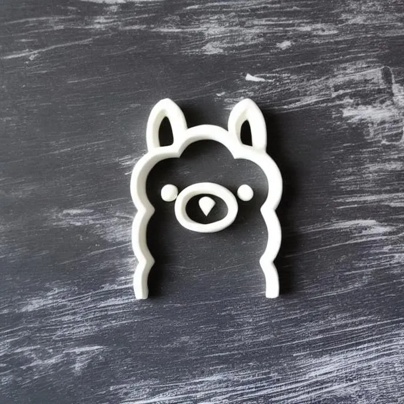

# ollama-clay



###### Image created using Segmind Workflows (https://www.segmind.com/)

-----

<br/>

### What is a mixture of RAG and HF?
While exploring areas of Generative AI, I stumbled upon Argilla. A platform for collaborating with a community to build high quality datasets. Argilla is packed with features including storing and searching vectors, and community driven ratings for each data entry. This led me to the thought of: what if we combined vector search with community feedback?

#### Scoring RAG and HF
By using Argilla's built in vector search ```find_similar_records()``` we get a list of records, each with a similarity score between 0 and 1.
Adding to that score a normalized calculation from each user rating collected for that record. This allows human feedback to augment retrieval.

#### Running RAG and HF
To run an LLM locally, I use Ollama (www.ollama.com) as a client and augment the prompt passed to ```client.chat``` using RAG and HF. In my demo ```demos/demo_balatro.py```, I chose to use Gemma 2B as the languge model, since I'm using RAG and HF I can make use of the smaller available language models. 

You can run the demo using ```python demo_balatro.py``` along with the dependencies in the section below. This connects to an Argilla dataset I created populated with facts on the game Balatro. Then after getting a prompt from a user, I use ```gte-small``` to encode the prompt and then use RAG and HF before augmenting the final prompt sent to Gemma 2B which is running on an Ollama client.

<br/>

---

<br/>

### Getting started with RAG and HF

You can use ```template.py``` as a starting point and fill-in and customize the sections required. To make use of this template, you will need to create an Argilla dataset and have Ollama installed, see the dependencies for more details:

##### Dependencies:
- Ollama client: www.ollama.com
- Argilla dataset: [link to repo](https://github.com/argilla-io/argilla)
- `pip install requirements.txt`

<br/>

---

<br/>

##### Acknowledgements
Argilla was the main inspiration behind this project. As I explored what the team at Argilla built, the feature set and ease of use allowed for an experiment like this to florish. I also can't thank Jeffrey Morgan and the team behind Ollama enough for making it so easy to run language models locally. Thank you!
